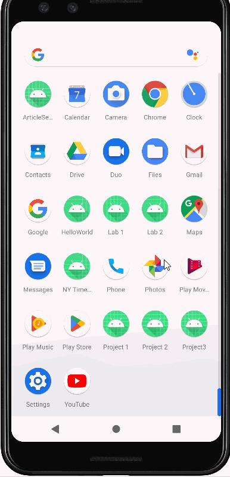

# Android Project 4 - *Flixster Plus*

Submitted by: **Piyush Sharma**

**Flixster** is a movie browsing app that allows users to browse the popular movies and see their description by clicking on them.

Time spent: **4** hours spent in total

## Required Features

The following **required** functionality is completed:

- [X] **Choose any endpoint on The MovieDB API except `now_playing`**
  - Chosen Endpoint: `/movie/popular`
- [X] **Make a request to your chosen endpoint and implement a RecyclerView to display all entries**
- [X] **Use Glide to load and display at least one image per entry**
- [X] **Click on an entry to view specific details about that entry using Intents**

The following **optional** features are implemented:

- [ ] **Add another API call and RecyclerView that lets the user interact with different data.** 
- [ ] **Add rounded corners to the images using the Glide transformations**
- [ ] **Implement a shared element transition when user clicks into the details of a movie**

The following **additional** features are implemented:

- [X] **Uses backdrop_path to extract the scene from the movie and displays it when you click on the entry**

## Video Walkthrough

Here's a walkthrough of implemented user stories:

<!-- Replace this with whatever GIF tool you used! -->
GIF created with ...  
<!-- Recommended tools:
[Kap](https://getkap.co/) for macOS
[ScreenToGif](https://www.screentogif.com/) for Windows
[peek](https://github.com/phw/peek) for Linux. -->

## Notes

Found implementing the Viewholder and onClick a little challenging but pretty fun.

## License

    Copyright [yyyy] [name of copyright owner]

    Licensed under the Apache License, Version 2.0 (the "License");
    you may not use this file except in compliance with the License.
    You may obtain a copy of the License at

        http://www.apache.org/licenses/LICENSE-2.0

    Unless required by applicable law or agreed to in writing, software
    distributed under the License is distributed on an "AS IS" BASIS,
    WITHOUT WARRANTIES OR CONDITIONS OF ANY KIND, either express or implied.
    See the License for the specific language governing permissions and
    limitations under the License.
